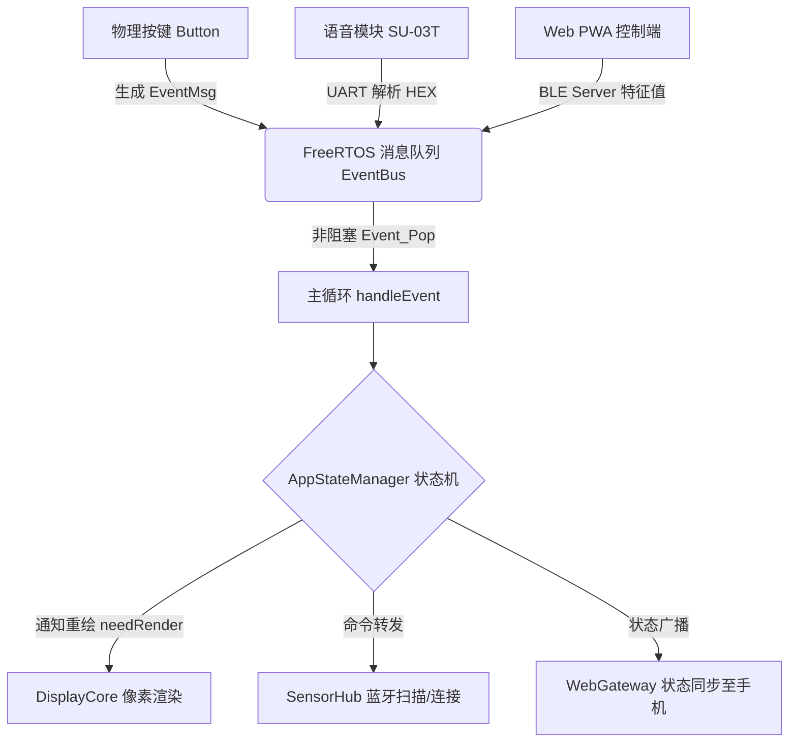

```
# 🚴‍♂️ Pixel-Box OS (智能骑行像素盒子)


Pixel-Box OS 是一款基于 ESP32-C3 构建的**沉浸式运动与桌面时钟综合终端**。它不仅是一个拥有“暗黑科技风”的 16x8 像素时钟，更是一个双模蓝牙传感器中枢。通过搭载纯事件驱动（Event-Driven）的底层架构、SU-03T 离线语音协处理器，以及免下载的 Web Bluetooth PWA 控制端，Pixel-Box 致力于提供**极稳、工业级、开机即用**的交互体验。

---

## ✨ 核心特性 (Features)

*   ⏱️ **多功能像素矩阵**：支持极简时钟、正向秒表、番茄倒计时、硬件级闹钟矩阵展示。
*   🚴 **双模蓝牙传感器中枢**：内置 NimBLE 客户端，自动寻呼并直连 **心率带 (HRM)** 与 **踏频器 (CSC)**，实现双屏实时数据渲染与曲柄转速计算。
*   🎙️ **全语音 NLP 交互**：搭载 SU-03T 语音协处理器，实现复杂的多级 FSM 对话（如自定义倒计时、闹钟组选择），并支持骑行数据（心率/踏频/里程）的 TTS 语音播报。
*   🌐 **Web PWA 无感控制**：彻底抛弃传统 App！基于 Web Bluetooth API 构建的纯静态前端网页，支持一键保存至手机桌面，实现全功能配置与 NVS 存储管理。
*   ⚡ **瞬态网络校时**：独创“用完即焚”的 WiFi NTP 策略。开机 3 秒内完成对时后彻底关断 WiFi 射频，将 2.4G 频段完全让渡给 BLE，保障极稳的数据吞吐。
*   🧠 **FreeRTOS 事件驱动**：告别单片机阻塞循环。所有外设（按键、语音、Web指令）均抽象为 `EventMsg` 压入消息队列，主循环非阻塞分发，永不卡死。

---

## 🛠️ 硬件底座 (Hardware Matrix)

| 模块名称 | 型号 / 规格 | 作用说明 |
| :--- | :--- | :--- |
| **主控 MCU** | 乐鑫 ESP32-C3 | 单核 RISC-V，160MHz，负责 BLE 通信与核心业务调度 |
| **显示矩阵** | WS2812B 8x8 (x2) | 物理拼接为 16x8 像素屏，通过 RMT 硬件驱动释放 CPU |
| **语音协处理器** | 启英泰伦 SU-03T | 离线语音 NPU，通过双向 UART 与主控进行 HEX 指令交互 |
| **物理按键** | HX-543 (4键矩阵) | 模式切换 (Mode)、加 (+)、减 (-)、确认 (OK) |
| **电源管理** | IP5306 | 充放电一体化，支持硬件休眠，Type-C 供电 |

---

## 🏗️ 软件架构 (Architecture)

系统采用**控制权分离 (Control Inversion)** 架构。PWA 网页和 SU-03T 语音模块被视为“无状态外设”，仅负责采集意图下发指令；核心业务计算与 NVS 持久化完全由 ESP32 内部的 `AppStateManager` 接管。



------

## 📂 目录结构 (Directory Structure)

Plaintext

```
Pixel-Box-ESP32/
├── src/                        # ESP32-C3 核心固件源码
│   ├── main.cpp                # 系统入口、主循环与界面渲染引擎
│   ├── EventBus.cpp            # FreeRTOS 消息队列与事件总线
│   ├── GlobalState.cpp         # 全局状态管理与 NVS 持久化
│   ├── DisplayCore.cpp         # FastLED 矩阵驱动与字模渲染
│   ├── SensorHub.cpp           # BLE Client：心率/踏频扫描与直连
│   ├── WebGateway.cpp          # BLE Server：PWA 指令解析网关
│   ├── VoiceAssistant.cpp      # SU-03T 语音模块 UART 通信
│   ├── VoiceInputMachine.cpp   # 多级语音交互的有限状态机 (FSM)
│   ├── ButtonManager.cpp       # 物理按键防抖与复用映射
│   ├── ModeManager.cpp         # AppMode 切换控制器
│   └── TimeSync.cpp            # 瞬态 WiFi NTP 校时模块
├── docs/                       # Web PWA 前端工程 (部署于 GitHub Pages)
│   ├── index.html              # 极简暗黑风 Web UI 骨架
│   ├── manifest.json           # PWA 桌面安装清单
│   ├── sw.js                   # Service Worker 离线缓存缓存
│   ├── css/style.css           # 赛博科技风 CSS 样式表
│   └── js/
│       ├── app.js              # PWA 主控逻辑与事件绑定
│       ├── ble.js              # Web Bluetooth API 蓝牙底层封装
│       └── ui.js               # 动态 DOM 渲染与日志系统
└── platformio.ini              # PlatformIO 工程配置文件
```

------

## 🚀 快速开始 (Getting Started)

### 1. 固件编译与烧录 (Firmware)

本项目使用 [PlatformIO](https://platformio.org/) 进行依赖管理和编译。

1. 克隆本仓库：

   Bash

   ```
   git clone [https://github.com/kloms-fame/Pixel-Box-ESP32.git](https://github.com/kloms-fame/Pixel-Box-ESP32.git)
   ```

2. 在 VSCode 中通过 PlatformIO 打开项目根目录。

3. 连接您的 ESP32-C3 核心板。

4. 点击 PlatformIO 左下角的 `Upload` 按钮进行编译和烧录（默认环境：`airm2m_core_esp32c3`）。

### 2. Web 端配网与控制 (PWA)

1. 开启手机或电脑的蓝牙功能（需使用 Chrome、Edge 或支持 Web BLE 的浏览器）。
2. 访问控制页面：[点击进入 Pixel-Box 控制台](https://www.google.com/search?q=https://kloms-fame.github.io/Pixel-Box-ESP32/docs/)
3. 点击 **[连接设备]**，在弹出的窗口中选择 `Pixel-Box-Core`。
4. 连接成功后，您可以在网页上进行：
   - 注入 WiFi SSID 和密码（用于开机闪电校时）。
   - 扫描并绑定周边的蓝牙心率带和踏频器。
   - 实时调节屏幕亮度、设置倒计时、管理 3 组硬件闹钟。

------

## 🗣️ 语音交互指令集 (Voice Commands)

设备支持免唤醒和唤醒词（“像素盒子 / 你好智骑”）。以下是部分核心控制词：

| **功能模块**   | **语音指令示例**          | **硬件执行动作**               | **语音回复 (TTS)**     |
| -------------- | ------------------------- | ------------------------------ | ---------------------- |
| **倒计时控制** | “设为五分钟” / “开始倒数” | 切换 UI，压入倒计时配置事件    | “已设置倒计时 5 分钟”  |
| **正向计时器** | “开始计时” / “重置计时”   | 秒表启动/归零                  | “已开始正向计时”       |
| **设备互联**   | “连接心率带” / “断开踏频” | BLE Client 启动定向扫描与直连  | “正在寻呼记忆心率设备” |
| **运动报告**   | “骑行数据” / “现在几点了” | 收集内存上下文，通过 UART 发送 | “当前心率 X，踏频 Y”   |
| **系统控制**   | “屏幕亮一点” / “关闭屏幕” | 修改亮度配置，写入 NVS         | “已调高屏幕亮度”       |
| **告警干预**   | “退下吧” / “关闭所有闹钟” | 清除中断标志位，停止蜂鸣器     | “已停止提醒”           |

*(完整指令集与底层 UART 16进制映射表，请参阅项目中的 `语音命令词基础信息.md`)*

------

## 协议声明 (Protocol Specifications)

本项目包含两套自研通信协议：

1. **Web BLE 协议**：基于 `6e400001-b5a3-f393-e0a9-e50e24dcca9e` 服务。数据包采用 `[CMD_ID] [Payload...]` 格式。例如前端下发亮度 100：`[0x01, 100]`。
2. **SU-03T UART 协议**：采用严格的帧头帧尾格式 `AA 55 [CMD] [Param1..n] 55 AA`。例如设备向语音模块发送当前踏频(120)：`AA 55 41 78 55 AA`。

------

## 📜 许可证 (License)

本项目采用 [MIT License](https://gemini.google.com/app/e47706ff8e75695a?hl=zh-cn) 开源协议。欢迎极客和骑行爱好者复刻、修改与分发。

> **免责声明**：本项目为业余爱好与学习交流所作。由于涉及运动心率等生理数据的读取，数据仅供参考，不作为医疗或专业竞速依据。


